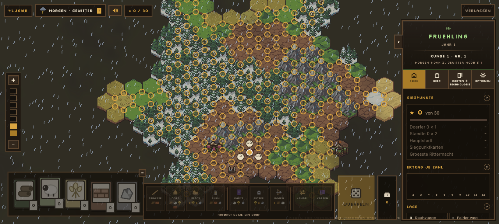
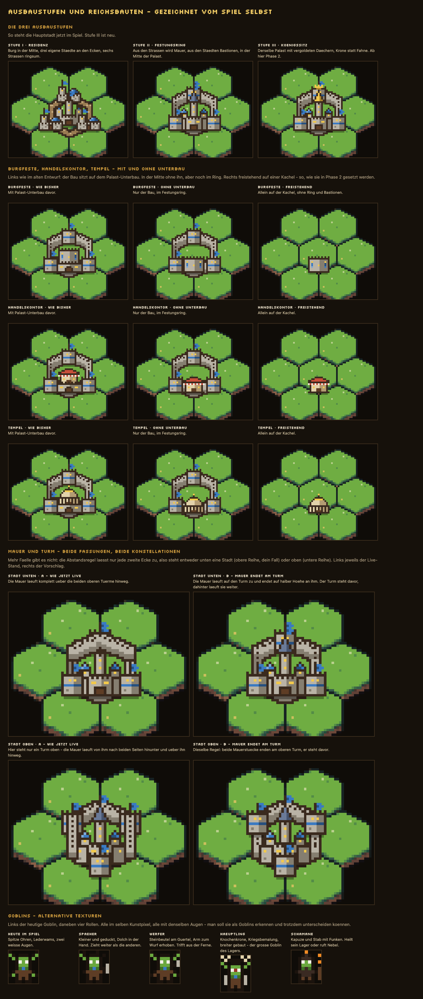
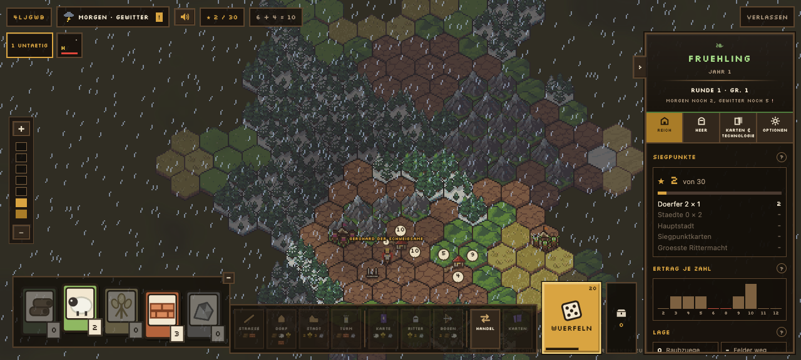

# Dogfood Report: InfiniteCarthage

| Field | Value |
|---|---|
| **Date** | 2026-09-17 |
| **App URL** | http://127.0.0.1:5173 |
| **Session** | infinite-carthage |
| **Scope** | Einstieg, Aufbauphase, erster Spielzug und Gebäudegrafik-Probe |

## Summary

| Severity | Count |
|---|---:|
| Critical | 0 |
| High | 0 |
| Medium | 4 |
| Low | 1 |
| **Total** | **5** |

## Issues

### ISSUE-001: Die Aufbauphase überzieht die gesamte Karte mit Bauplatzringen

| Field | Value |
|---|---|
| **Severity** | medium |
| **Category** | visual / ux |
| **URL** | http://127.0.0.1:5173 |
| **Repro Video** | N/A |

**Description**

Beim ersten Dorf werden fast alle legalen Ecken der erzeugten Welt gleichzeitig mit gleich gewichteten goldenen Ringen markiert. Geländeformen, interessante Startorte und Zahlen lassen sich dadurch schlechter vergleichen; die Interaktionsschicht wird zum dominanten Bildinhalt.

**Repro Steps**

1. Einen Raum erstellen und „Allein starten“ wählen.
2. In der Aufforderung „Aufbau: Setze ein Dorf“ die Karte betrachten.
   

---

### ISSUE-002: Der erste Zug beginnt als Weltübersicht statt als lokale Entscheidung

| Field | Value |
|---|---|
| **Severity** | medium |
| **Category** | ux |
| **URL** | http://127.0.0.1:5173 |
| **Repro Video** | N/A |

**Description**

Die Kamera zeigt beim Spielstart nahezu die ganze erzeugte Landmasse. Die eigentliche Startentscheidung und später die gebauten Dörfer sind im Verhältnis sehr klein. Das vermittelt zwar „unendlich“, erschwert aber die erste konkrete Entscheidung und erzeugt Analyse-Paralyse.

**Repro Steps**

1. Eine neue Solopartie beginnen.
2. Die anfängliche Kameraposition und Zoomstufe betrachten.
   

---

### ISSUE-003: Bauplatzwahl zeigt keine Priorität oder Empfehlung

| Field | Value |
|---|---|
| **Severity** | medium |
| **Category** | ux |
| **URL** | http://127.0.0.1:5173 |
| **Repro Video** | N/A |

**Description**

Alle legalen Plätze sehen zunächst gleich wichtig aus. Erst am einzelnen Platz werden die drei angrenzenden Zahlen hervorgehoben. Für neue Spieler fehlt eine kleine, erklärbare Vorauswahl wie „guter Ertrag“, „ausgewogene Rohstoffe“ oder „sicherer Start“.

**Repro Steps**

1. Eine neue Solopartie beginnen.
2. Die gleichförmige Menge der legalen Plätze vergleichen.
   

---

### ISSUE-004: Die visuelle Hierarchie von Mauer, Turm und Palast ist fallabhängig

| Field | Value |
|---|---|
| **Severity** | medium |
| **Category** | visual |
| **URL** | http://127.0.0.1:5173/probe-bauten.html |
| **Repro Video** | N/A |

**Description**

Die vorhandene Probe dokumentiert den Fehlerfall, in dem ganze Mauerzüge je nach Reihenfolge über Türme laufen. Die Variante „Mauer endet am Turm“ liest sich deutlich besser. Der aktuelle Board-Code enthält dafür bereits Sonderlogik (`kurzeMauer`); die Probe zeigt trotzdem, warum ein einheitliches Tiefenmodell nötig ist: Das Problem betrifft die Zeichenreihenfolge und Maskierung mehrerer Bauteile, nicht nur ein einzelnes Sprite.

**Repro Steps**

1. Die Gebäudegrafik-Probe öffnen.
2. Zum Abschnitt „Mauer und Turm“ scrollen.
3. „A – wie jetzt live“ und „B – Mauer endet am Turm“ vergleichen.
   

---

### ISSUE-005: Sichtbarer Platzhalter „Bevölkerung“ erzeugt eine leere Sackgasse

| Field | Value |
|---|---|
| **Severity** | low |
| **Category** | content / ux |
| **URL** | http://127.0.0.1:5173 |
| **Repro Video** | N/A |

**Description**

Im Hauptmenü der laufenden Partie ist „Bevölkerung“ bereits als Abschnitt sichtbar, obwohl dort nur angekündigt wird, dass Bevölkerung und Beliebtheit später folgen. In einer ohnehin informationsreichen Oberfläche wirkt das wie eine fehlende Funktion und nimmt Aufmerksamkeit von spielbaren Systemen.

**Repro Steps**

1. Die Solopartie bis zum ersten regulären Zug spielen.
2. Den Reiter „Reich“ betrachten.
   
